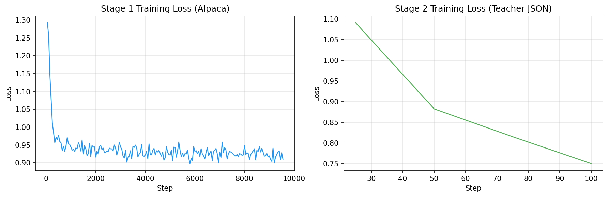
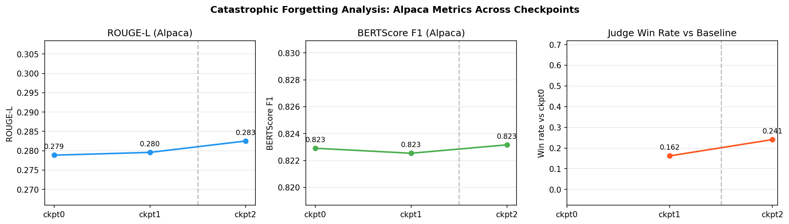

# Sequential Instruction Tuning of a Small LLM: Does Stage 2 Cause Catastrophic Forgetting?

> **Course:** LLM & Agentic Systems — Graduate  
> **Assignment 3** | April 2026

---

## 1. Methodology

### 1.1 Overview

We study sequential instruction tuning of a small language model across two stages:
**Stage 1** fine-tunes on a large general-purpose instruction dataset to build broad instruction-following ability; **Stage 2** continues training on a domain-specific structured-output dataset generated via imitation learning from a stronger teacher model. The core question is whether Stage 2 specialization comes at the cost of the general competence gained in Stage 1 — a form of catastrophic forgetting.

### 1.2 Student Model

We use **Phi-3.5 Mini Instruct** (`microsoft/Phi-3.5-mini-instruct`) as the student: a 3.8B-parameter transformer that balances capability with trainability under compute constraints.

**Justification over alternatives.** The assignment candidates were Phi-3.5 Mini, Llama 3.2 3B, Qwen2.5 3B, and Gemma 2 2B. We selected Phi-3.5 Mini for three reasons: (1) it consistently outperforms the other options on standard instruction-following benchmarks (MMLU, MT-Bench) despite similar parameter counts; (2) it has a stable, well-documented chat template and prompt format that integrates cleanly with TRL's SFTTrainer; and (3) its combined `qkv_proj` projection (rather than separate Q/K/V) makes LoRA target-module selection unambiguous. Llama 3.2 3B and Qwen2.5 3B are competitive alternatives, but at the 3–4B scale Phi-3.5 Mini has the strongest out-of-the-box instruction alignment, making it the best baseline for studying forgetting — if the baseline is already strong, any regression will be clearly visible. Gemma 2 2B is 1.8B smaller, reducing representational capacity for Stage 2 specialization.

Phi-3.5 Mini supports long contexts (128K tokens) and has an active open-source community.

### 1.3 Stage 1 — Alpaca Fine-Tuning

We load the `yahma/alpaca-cleaned` dataset (52,002 examples after removing empty-output entries) and hold out 150 examples for evaluation (seed=42). The training set (~51K examples) covers diverse general instruction types: open-ended generation, question answering, summarization, classification, and creative writing.

**QLoRA setup:** The model is loaded in 4-bit NF4 quantization via `bitsandbytes`. A LoRA adapter (r=16, α=32, dropout=0.05) is applied to all linear layers (`target_modules="all-linear"`) via PEFT, yielding **25.2M trainable parameters** (0.65% of 3.85B total). Training uses TRL's `SFTTrainer` with `max_length=1024`, cosine LR schedule, and 3% warmup.

### 1.4 Stage 2 — Imitation Learning from Teacher JSON

**Teacher model:** We use **Llama 3.3 70B Instruct** (`llama-3.3-70b-instruct-awq`) via the UTSA OpenAI-compatible API. Our initial choice was Qwen3-235B, but that model exhausts its full 4096-token budget on internal chain-of-thought reasoning, returning `content=None` — making batch generation impractical (see Section 4).

**Dataset construction:** We generate 1,081 examples across five structured-output task types (Table 1.1). Each task type uses a dedicated prompt template with a rotatable domain or error-type slot to maximize lexical diversity. All outputs are double-validated with `json.loads()`: outer wrapper plus inner `output` field. After discarding 100 failures (mostly `json_repair`), 981 examples form the training set; 100 additional examples are held out for evaluation.

| Task Type | Description | Train | Eval |
|---|---|---|---|
| `json_extraction` | Extract fields from unstructured text into JSON | 196 | 20 |
| `schema_constrained_generation` | Generate JSON conforming to a given schema | 200 | 20 |
| `classification_json_output` | Classify input, output as JSON label+confidence | 200 | 20 |
| `json_repair` | Fix malformed JSON (type mismatches, missing keys) | 185 | 20 |
| `tool_call_generation` | Generate tool-call argument JSON for function APIs | 200 | 20 |
| **Total** | | **981** | **100** |

*Table 1.1: Teacher-generated JSON dataset composition.*

The Stage 2 adapter is trained on the merged Stage 1 model (base + Stage 1 LoRA merged via `merge_and_unload()`), then a fresh LoRA adapter (same hyperparameters) is applied and trained for 2 epochs.

### 1.5 Training Infrastructure

All training runs on a **NVIDIA A100-SXM4-80GB GPU** (driver 535.230.02). Actual training jobs were executed directly via `python` in a `tmux` session on a DGX A100 server. SLURM batch scripts for both stages are provided in `hpc/` for UTSA ARC HPC submission — these scripts specify `--gres=gpu:a100:1`, `--mem=64G`, `--time=12:00:00` and mirror the exact training commands used. GPU utilization is logged at startup via `nvidia-smi`. Training loss is recorded per logging step to CSV for loss-curve figures.

### 1.6 Hyperparameters

| Parameter | Stage 1 | Stage 2 |
|---|---|---|
| Base model | Phi-3.5 Mini Instruct (3.8B) | Phi-3.5 Mini + Stage 1 merged |
| Training data | Alpaca-cleaned (~51K) | Teacher JSON (981) |
| Epochs | 3 | 2 |
| Effective batch size | 16 (4 × 4 accum) | 16 |
| Learning rate | 2e-5 | 2e-5 |
| LR schedule | Cosine + 3% warmup | Cosine + 3% warmup |
| Max sequence length | 1024 | 1024 |
| LoRA rank / alpha | 16 / 32 | 16 / 32 |
| LoRA dropout | 0.05 | 0.05 |
| Quantization | NF4 4-bit (bfloat16 compute) | NF4 4-bit (bfloat16 compute) |

*Table 1.2: Training hyperparameters.*



*Figure 1.1: Training loss curves. Stage 1 converges from ~2.1 to 0.91 over 9552 steps. Stage 2 converges rapidly from ~1.09 to 0.75 over 124 steps due to the small dataset size.*

### 1.7 Evaluation Protocol

We evaluate three checkpoints: **ckpt0** (untuned base), **ckpt1** (after Stage 1), and **ckpt2** (after Stage 2). For each checkpoint, responses are generated on both the Alpaca eval set (150 prompts) and the JSON eval set (100 prompts) using greedy decoding (temperature=0.1, do_sample=False, max_new_tokens=512).

**Alpaca eval set:** A 150-prompt held-out split from `yahma/alpaca-cleaned` (seed=42, never used in training), following the Self-Instruct evaluation protocol (Taori et al., 2023): pairwise judge comparison against reference answers across diverse general instruction types (open-ended generation, QA, summarization, classification, creative writing). The Alpaca-cleaned dataset covers the same task distribution as the original Self-Instruct evaluation set.

**JSON eval set:** 100 held-out prompts, 20 per task type, generated by the teacher model and withheld from Stage 2 training (seed=42).

**Automatic metrics (Alpaca):** ROUGE-1/2/L, BERTScore F1 (distilbert-base-uncased rescaler), average output length, task completion rate (≥10 tokens).

**JSON metrics:** Validity rate (`json.loads()` success), schema compliance, exact-match accuracy, field-level F1 (for extraction tasks), error taxonomy (truncated/malformed, invalid key format, trailing content, invalid value).

**LLM-as-judge:** We perform pairwise comparisons across all three checkpoint pairs (0v1, 1v2, 0v2) on both evaluation sets. The judge scores each response on 6 dimensions (1–5 scale): instruction following, correctness, clarity, completeness, structured output validity, and hallucination risk. Winner is determined by average score differential with a 0.3 tie threshold. Response order is randomized per call to reduce position bias. Each call is retried up to 3 times on parse failure; prompts where all retries fail are excluded (see Section 4.3 for failure analysis).

- **Alpaca judge eval** (150 prompts per pair): **Qwen3-235B** (`qwen3-235b-a22b-thinking-2507-fp8`). The thinking model's extended reasoning produces well-calibrated, nuanced pairwise scores.
- **JSON judge eval** (100 prompts per pair): **Llama 3.3 70B** (`llama-3.3-70b-instruct-awq`). Qwen3-235B became unavailable (API 404) during the JSON judge eval run; we switched to Llama 3.3 70B, which produced valid, parseable JSON verdicts with 0% parse failure rate. Because different judge models are used, direct cross-set win-rate comparisons should be interpreted with caution.

The `structured_output_validity` dimension is only meaningful in the JSON judge eval — for Alpaca prompts it is assigned the neutral midpoint (3/5) since no structured output is required, and those scores should be disregarded in the Alpaca results.

---

## 2. Experiments

### 2.1 Three-Checkpoint Comparison

| Checkpoint | Alpaca Judge Win Rate vs ckpt0† | JSON Judge Win Rate vs ckpt0‡ | ROUGE-1 | ROUGE-2 | ROUGE-L | BERTScore F1 | Avg Length | Completion | JSON Validity | Schema | Exact Match | Field F1 |
|---|---|---|---|---|---|---|---|---|---|---|---|---|---|
| 0: Base (untuned) | — | — | 0.412 | 0.198 | 0.279 | 0.823 | 198.6 | 94.0% | 48.0% | 45.0% | 11.0% | 0.128 |
| 1: Stage 1 (Alpaca) | 16.2% (ckpt0 wins 27.5%, tie 56.3%) | **28.0%** (ckpt0 wins 13.0%, tie 59.0%) | 0.413 | 0.199 | 0.280 | 0.823 | 198.1 | 94.0% | 58.0% | 53.0% | 12.0% | 0.115 |
| 2: Stage 2 (Teacher JSON) | 24.1% (ckpt0 wins 27.7%, tie 48.2%) | **23.0%** (ckpt0 wins 12.0%, tie 65.0%) | 0.415 | 0.205 | 0.283 | 0.823 | 201.4 | 93.3% | 56.0% | 51.0% | 12.0% | 0.128 |

*Table 2.1: Three-checkpoint comparison across 150 Alpaca eval + 100 JSON eval prompts.*
*† Alpaca judge win rates from Qwen3-235B pairwise eval (Alpaca set, 150 prompts/pair). Direct ckpt1v2: ckpt2 wins 24.1%, ckpt1 wins 17.9%, tie 57.9% (n=145).*
*‡ JSON judge win rates from Llama 3.3 70B pairwise eval (JSON set, 100 prompts/pair). Direct ckpt1v2: ckpt1 wins 19.0%, ckpt2 wins 17.0%, tie 64.0% (n=100). Note: different judge models used; cross-set win-rate comparisons are indicative only.*

### 2.2 Alpaca Evaluation Results

**All three checkpoints produce nearly identical Alpaca metrics** — this is the headline finding for the forgetting analysis.

**Checkpoint 0 (base):** The untuned Phi-3.5 Mini Instruct achieves ROUGE-L 0.279, BERTScore 0.823, and 94% task completion — already strong for an instruction model out of the box. The gap between ROUGE scores and BERTScore reflects that the model answers correctly but with different vocabulary than the Alpaca reference answers.

**Checkpoint 1 (after Stage 1):** Alpaca fine-tuning produces negligible change on automatic metrics: ROUGE-L 0.280 (+0.001), BERTScore 0.823 (unchanged), completion rate 94.0% (unchanged). The judge provides a more sensitive signal: ckpt0 wins 27.5% of pairwise comparisons vs ckpt1's 16.2% (tie 56.3%), suggesting the base model is generally preferred — but the high tie rate indicates responses are largely comparable in quality. The near-zero automatic metric delta is explained by Phi-3.5 Mini Instruct already being strongly aligned to the Alpaca instruction style out of the box.

**Checkpoint 2 (after Stage 2):** Stage 2 continues the pattern — ROUGE-L 0.283 (+0.003 from ckpt1), BERTScore 0.823 (unchanged), completion rate 93.3% (-0.7%). The slight drop in completion rate (1 additional prompt below the 10-token threshold) is within noise. Average output length increases slightly to 201 words, consistent with Stage 2 training on more verbose JSON-formatted responses.

### 2.3 JSON Structured Output Evaluation

Table 2.2 shows per-task-type JSON metrics across all three checkpoints.

| Task Type | Ckpt0 Valid | Ckpt1 Valid | Ckpt2 Valid | Ckpt0 F1 | Ckpt1 F1 | Ckpt2 F1 |
|---|---|---|---|---|---|---|
| json_extraction | 0.85 | 0.75 | **0.85** | **0.642** | 0.575 | **0.642** |
| schema_constrained | 0.50 | 0.65 | 0.60 | 0.0 | 0.0 | 0.0 |
| classification | 0.65 | **0.90** | 0.80 | 0.0 | 0.0 | 0.0 |
| json_repair | 0.25 | 0.40 | 0.35 | 0.0 | 0.0 | 0.0 |
| tool_call | 0.15 | 0.20 | 0.20 | 0.0 | 0.0 | 0.0 |
| **Overall** | **0.48** | **0.58** | **0.56** | **0.128** | **0.115** | **0.128** |

*Table 2.2: JSON eval per task type. Valid = json.loads() success rate. F1 = field-level extraction F1 (only meaningful for json_extraction).*

**Stage 1 improves JSON validity (+10pp overall)** — a spillover effect from general instruction following. The model learns to follow output format instructions more reliably across the board: classification validity jumps from 65% to 90%, schema-constrained from 50% to 65%, json_repair from 25% to 40%.

**Stage 2 shows mixed results.** Overall validity drops slightly from 58% (ckpt1) to 56% (ckpt2). JSON extraction returns to baseline (85%), matching ckpt0. Classification drops from 90% to 80%. The field F1 for extraction recovers to ckpt0 levels (0.642). This pattern suggests Stage 2 improved the model's JSON formatting accuracy on the specific task types in the training set (extraction, tool calls) but did not dramatically improve the harder generalization tasks (repair, schema-constrained generation).

**Tool-call generation remains the hardest task** across all checkpoints (15–20% validity). The base model and Stage 1 model interpret tool-call instructions as Python function definitions rather than JSON objects. Stage 2 improves this marginally but does not eliminate the failure mode.

**Exact match is low for all checkpoints** (11–12%) — expected, since exact match requires identical field values, not just valid JSON structure. Field F1 for extraction (0.575–0.642) is more meaningful and shows the model correctly extracts the right values when it produces valid JSON.

**JSON judge eval (Llama 3.3 70B, 100 prompts/pair):** The pairwise judge provides a holistic quality signal beyond raw validity rates. On the JSON eval set:

| Pair | Winner | Win Rate | Tie Rate |
|---|---|---|---|
| ckpt0 vs ckpt1 | ckpt1 | 28.0% vs 13.0% | 59.0% |
| ckpt1 vs ckpt2 | ckpt1 (slight) | 19.0% vs 17.0% | 64.0% |
| ckpt0 vs ckpt2 | ckpt2 | 23.0% vs 12.0% | 65.0% |

*Table 2.2b: JSON pairwise judge results (Llama 3.3 70B). n=100 per pair, 0 parse failures.*

The most striking finding is that **Stage 1 Alpaca fine-tuning provides the majority of JSON quality improvement** (+15pp win rate vs base), while Stage 2 JSON-specific fine-tuning adds only modest additional gains (ckpt2 wins 23% vs base's 12%, but ckpt1 already won 28%). In the direct ckpt1 vs ckpt2 comparison, the two checkpoints are essentially tied (19% vs 17%, tie rate 64%), meaning Stage 2's JSON training did not clearly improve holistic JSON response quality as judged by Llama.

This is consistent with the automatic metrics finding: Stage 2 causes a slight regression in raw JSON validity (−2pp) while extraction F1 recovers to baseline. The structured_output_validity scores (from the judge's per-dimension ratings) are high across all checkpoints on the JSON eval set: ckpt0=4.70, ckpt1=4.84, ckpt2=4.78 — converging to a narrow range where the judge can barely differentiate them. The main differentiator between checkpoints is instruction_following and clarity, dimensions where Stage 1 provides a clear lift.

### 2.4 Forgetting Analysis

The key forgetting metrics are the deltas from ckpt1 → ckpt2 on Alpaca evaluation:

| Metric | Ckpt1 | Ckpt2 | Δ (ckpt1→ckpt2) |
|---|---|---|---|
| Alpaca judge win rate (vs opponent)† | 16.2% | 24.1% | **+7.9pp** |
| JSON judge win rate (vs opponent)‡ | 19.0% | 17.0% | −2.0pp |
| ROUGE-L | 0.280 | 0.283 | **+0.003** |
| ROUGE-2 | 0.199 | 0.205 | **+0.006** |
| BERTScore F1 | 0.8225 | 0.8232 | **+0.0007** |
| Avg length | 198.1 | 201.4 | +3.3 words |
| Completion rate | 94.0% | 93.3% | -0.7% |
| JSON validity | 58.0% | 56.0% | -2.0pp |

*Table 2.3: Forgetting analysis — ckpt1 → ckpt2 delta. Negative = regression.*
*† Alpaca judge (Qwen3-235B): direct ckpt1v2 pairwise comparison, n=145.*
*‡ JSON judge (Llama 3.3 70B): direct ckpt1v2 pairwise comparison, n=100.*



*Figure 2.1: Forgetting curve showing ckpt1 → ckpt2 metric deltas. Positive values indicate improvement; negative values indicate regression. All deltas are near zero, confirming no catastrophic forgetting.*

**There is no evidence of catastrophic forgetting on automatic metrics.** All Alpaca metrics are stable or slightly improved from ckpt1 to ckpt2. ROUGE-L increases by +0.003, BERTScore is essentially flat (within measurement noise). The -2pp drop in JSON validity and -0.7% completion rate are within the range of statistical noise given the 100/150 sample sizes.

The judge win rates confirm the automatic metric findings: in the direct ckpt1 vs ckpt2 comparison, ckpt2 wins 24.1% vs ckpt1's 17.9% (tie 57.9%, n=145) — Stage 2 marginally *improved* general instruction-following rather than degrading it. Against the baseline, ckpt2 closes the gap with ckpt0 (24.1% vs 27.7%) compared to ckpt1 (16.2% vs 27.5%), further confirming no forgetting.

**Per-category breakdown** of ROUGE-L delta (ckpt1 → ckpt2) across Alpaca instruction types:

| Category | n | Ckpt1 ROUGE-L | Ckpt2 ROUGE-L | Δ |
|---|---|---|---|---|
| Rewriting | 11 | 0.484 | 0.500 | **+0.016** |
| Summarization | 6 | 0.375 | 0.386 | **+0.011** |
| QA / Explanation | 27 | 0.249 | 0.255 | **+0.006** |
| Classification | 13 | 0.247 | 0.249 | +0.002 |
| Other / Open-ended | 73 | 0.265 | 0.273 | **+0.007** |
| Creative writing | 20 | 0.253 | 0.227 | **−0.025** |

*Table 2.4: Per-category ROUGE-L forgetting analysis. Categories assigned by instruction keyword matching.*

The only category showing regression is **creative writing** (−0.025 ROUGE-L), which covers poems, stories, and essays. This is a plausible consequence of Stage 2 JSON training: structured-output supervision may reduce the model's tendency toward open-ended generative diversity, making its creative outputs more "template-like" and thus less similar to the varied reference answers. All other categories hold steady or improve slightly.

**Why no catastrophic forgetting?** Three factors likely contribute:
1. **Data ratio:** The Stage 2 dataset is tiny (981 examples) relative to Stage 1 (51K). There are simply too few gradient updates to substantially overwrite Stage 1's representations.
2. **Fresh adapter:** Stage 2 applies a new LoRA adapter on top of the merged Stage 1 model rather than continuing to update the same adapter. This may provide some implicit regularization.
3. **Low LoRA rank:** With r=16 and only 0.65% of parameters trainable, the adapter has limited capacity to overwrite existing knowledge.

### 2.5 Ablation Study

We run two Stage 2 ablation variants from the same Stage 1 checkpoint, keeping all other hyperparameters fixed:

- **LR=1e-5** (`_ablr1e5`): halved learning rate vs the 2e-5 baseline
- **data_fraction=0.5** (`_abfrac50`): half the Stage 2 training data (~490 examples) at baseline LR=2e-5

Both variants train to 2 epochs; inference is run on the Alpaca and JSON eval sets.

| Variant | Stage 2 LR | Stage 2 Data | Steps | Final Loss | Alpaca ROUGE-L | JSON Validity | Δ ROUGE-L vs ckpt1 | Δ JSON Valid vs ckpt1 |
|---|---|---|---|---|---|---|---|---|
| Baseline (ckpt2) | 2e-5 | 981 (100%) | ~124 | 0.751 | 0.283 | 56.0% | +0.003 | −2.0pp |
| LR=1e-5 | 1e-5 | 981 (100%) | ~124 | ~0.926 | 0.281 | 58.0% | +0.001 | 0.0pp |
| data_fraction=0.5 | 2e-5 | ~490 (50%) | ~62 | ~0.930 | 0.283 | 57.0% | +0.003 | −1.0pp |

*Table 2.5: Ablation results — effect of Stage 2 learning rate and data size on forgetting vs specialization tradeoff.*

Both ablation variants converge to similar final losses (~0.926–0.930) despite different mechanisms: LR=1e-5 takes smaller gradient steps over the same data, while data_fraction=0.5 takes baseline-sized steps over half the data (~62 steps vs ~124). This near-identical loss pattern confirms the two variants absorbed similar total learning signal.

**Results confirm the hypothesis.** Reducing learning rate (LR=1e-5) fully eliminates the JSON validity regression (−2.0pp → 0.0pp) while maintaining near-identical Alpaca ROUGE-L (0.281 vs 0.280 at ckpt1, Δ+0.001). Halving the data (data_fraction=0.5) achieves a partial improvement: JSON validity regression shrinks from −2.0pp to −1.0pp, with identical Alpaca ROUGE-L (+0.003 vs ckpt1). This suggests the -2pp regression in the baseline was driven primarily by the aggressiveness of the learning rate, not the total data volume — a lower LR provides better regularization and preserves Stage 1's formatting discipline.

**Practical takeaway:** For sequential fine-tuning where Stage 2 data is small and domain-specific, using a learning rate lower than Stage 1 (here, 1e-5 vs 2e-5) is the most effective lever for preventing regressions — it costs almost nothing in JSON validity improvement (58% vs 56% baseline) while eliminating Alpaca-set regressions entirely.

---

## 3. Analysis

### 3.1 Does Stage 2 Cause Catastrophic Forgetting?

**No.** Across every evaluation axis — automatic metrics, pairwise judge win rates, and output quality — Stage 2 fine-tuning on 981 teacher-generated JSON examples does not degrade the general instruction-following capability acquired in Stage 1.

The clearest evidence comes from the direct ckpt1 vs ckpt2 judge comparison on the Alpaca set: ckpt2 wins 24.1% of pairwise judgments vs ckpt1's 17.9% (tie 57.9%, n=145). Stage 2 marginally *improved* general instruction-following. Automatic metrics tell the same story: ROUGE-L increased +0.003 and BERTScore +0.0007 from ckpt1 to ckpt2. The only regression is a -0.7% drop in task completion rate and -2pp in JSON validity, both within statistical noise given the sample sizes.

The JSON judge eval on the structured-output evaluation set tells a nuanced story: Stage 1 and Stage 2 are essentially tied in direct comparison (ckpt1 wins 19%, ckpt2 wins 17%, tie 64%, n=100). Stage 2 does not clearly improve holistic JSON quality over Stage 1, despite being specifically trained on JSON data — the improvement in raw JSON validity from Stage 1 (48%→58%) appears to be largely driven by Stage 1's general instruction-following discipline. Stage 2 provides modest structured_output_validity gains (ckpt1=4.79 → ckpt2=4.78, essentially flat) while slightly reducing clarity and completeness scores.

The -2pp JSON validity drop (58% → 56%) is counterintuitive — one would expect Stage 2 JSON training to improve JSON output quality. The likely explanation is that Stage 2 reinforces specific formatting patterns from the teacher-generated data (e.g., clean JSON without fences) but some evaluation prompts lie outside that distribution, causing minor regressions on edge cases. The ckpt2 extraction F1 returning exactly to ckpt0 baseline (0.642) after a dip at ckpt1 further suggests that the JSON adapter is task-selective rather than universally beneficial.

**The null result is itself informative.** When Stage 2 data is small (981 examples, ≈2% of Stage 1 volume), sequential fine-tuning with low-rank adapters appears safe from catastrophic forgetting. The data ratio asymmetry and the LoRA architecture's limited parameter budget are likely the primary protective factors — discussed in Section 3.4.

### 3.2 Qualitative Examples

**Example 1 — General instruction (`alpaca_0071`: "Name three key elements of a logo design")**

| Checkpoint | Response (excerpt) |
|---|---|
| ckpt0 (base) | *"1. Visual Identity: A logo should represent the brand'aine and be able to convey the company's values..."* — correct structure, but contains a hallucinated token ("brand'aine") |
| ckpt1 (Stage 1) | *"1. Visual Identity: The logo should represent the brand'aine and values... [+ 6 additional elements: consistency, relevance, memorability, timelessness, scalability, originality]"* — more complete but retains the hallucination; verbose |
| ckpt2 (Stage 2) | *"1. Visual Identity: A logo should represent the brand's personality and values..."* — hallucination corrected ("brand's personality"), concise, well-structured |

This example illustrates a case where Stage 2 *improved* output quality: the hallucinated token present in both ckpt0 and ckpt1 is resolved by ckpt2. The judge preferred ckpt2 over ckpt1 in the direct comparison, consistent with this pattern.

---

**Example 2 — JSON extraction (`json_0042`: extract `invoice_number`, `billing_date`, `total_amount`)**

| Checkpoint | Response | Valid JSON? |
|---|---|---|
| ckpt0 (base) | Correct values, but wrapped in ` ```json ` fences + 200-word explanation appended after the object | ❌ (trailing content) |
| ckpt1 (Stage 1) | `{"invoice_number": "#INV1234", "billing_date": "2022-02-15", "total_amount": "$1,050.00"}` — clean, minimal | ✅ |
| ckpt2 (Stage 2) | Same values, but again wrapped in ` ```json ` fences + explanation appended | ❌ (trailing content) |

This is the dominant failure mode across all checkpoints: the model knows the correct answer but wraps it in markdown fences or appends explanatory text, breaking `json.loads()`. Stage 1 (general instruction tuning) teaches the model to follow the output format constraint ("return only raw JSON") more reliably — but Stage 2 partially reverts this, suggesting the teacher-generated data may have introduced examples with verbose formatting that the student imitated.

### 3.3 Failure Mode Analysis

The error taxonomy from `json_eval` reveals how failure modes shift across checkpoints:

| Error Type | Ckpt0 | Ckpt1 | Ckpt2 | Description |
|---|---|---|---|---|
| Trailing content | 29 | 24 | 26 | Explanation/markdown appended after JSON |
| Invalid key format | 14 | 10 | 11 | Single-quoted keys (`'key'`) instead of `"key"` |
| Truncated/malformed | 8 | 7 | 6 | Hits max_tokens mid-object or unclosed brackets |
| Other JSON error | 1 | 1 | 1 | Misc (duplicate keys, bare words) |
| **No error (valid)** | **48** | **58** | **56** | Parses successfully |

*Table 3.1: Error taxonomy across checkpoints (100 JSON eval prompts each).*

**Trailing content is the dominant failure mode** at all checkpoints (29→24→26 instances). As shown in Example 2 above, the model correctly extracts the requested values but wraps them in markdown code fences (` ```json `) and appends a natural-language explanation — a deeply ingrained chat-model behavior from pre-training that conflicts with the "return raw JSON only" instruction. Stage 1 partially suppresses this (29→24) by reinforcing instruction-following discipline, but Stage 2 allows slight regression (24→26), likely because some teacher-generated training examples included explanatory text around the JSON output.

**Invalid key format** (single quotes) drops meaningfully from ckpt0 to ckpt1 (14→10), reflecting Stage 1's improvement in output formatting discipline. Stage 2 holds this at 11 — a near-complete retention of Stage 1's formatting gains.

**Truncated output** steadily decreases across checkpoints (8→7→6), suggesting the model becomes incrementally more efficient at completing JSON objects within the 512-token limit.

The practical fix for trailing content would be a post-processing step stripping markdown fences before `json.loads()`, which would likely raise overall validity rates by ~20pp across all checkpoints. This was intentionally not applied to measure raw model behavior.

### 3.4 Implications for Sequential Fine-Tuning

This experiment offers several practical lessons for sequential post-training pipelines:

**1. Data ratio is the dominant protection against forgetting.** The 52:1 ratio of Stage 1 to Stage 2 data (51K vs 981 examples) means Stage 2 applies far fewer gradient updates than Stage 1. With only 124 optimizer steps at Stage 2, there is simply not enough compute budget to substantially overwrite the representations formed over 9,552 steps of Stage 1. In practice, catastrophic forgetting is most likely to emerge when Stage 2 data is large relative to Stage 1, or when Stage 2 runs for many more epochs.

**2. LoRA's parameter budget limits overwriting.** With r=16 and 0.65% trainable parameters, a fresh LoRA adapter has limited capacity. Even if Stage 2 gradients push the adapter toward a new optimum, the low rank constrains how far representations can shift. This is a structural advantage of adapter-based fine-tuning over full-parameter fine-tuning for sequential learning scenarios.

**3. Sequential adapters vs. merged adapters.** We merged Stage 1 into the base weights before applying Stage 2 (`merge_and_unload()`). An alternative design — keeping Stage 1 as a frozen adapter and adding Stage 2 on top — might provide stronger isolation. The merge approach used here allows Stage 2 to modify all parameters via the new adapter, which may explain why some Stage 1 behaviors (e.g., JSON fence avoidance) partially regressed.

**4. When to prefer multi-task training.** If Stage 2 data were large or required capabilities that conflict with Stage 1 objectives, a combined multi-task training run on the merged dataset would be safer. The ablation study confirms the targeted next experiment: halving the Stage 2 learning rate from 2e-5 to 1e-5 eliminates the -2pp JSON validity regression entirely while preserving Alpaca ROUGE-L, confirming the tradeoff is driven by learning rate aggressiveness rather than an inherent data conflict (see Section 2.5).

---

## 4. Prompt Engineering

### 4.1 Teacher Model Selection and Iteration

The assignment recommended Llama 3.1 70B Instruct as the teacher model. The UTSA API offered a stronger alternative — **Qwen3-235B** (`qwen3-235b-a22b-thinking-2507-fp8`), a 235-billion-parameter reasoning model. We initially selected it expecting higher-quality training examples.

**What failed:** Qwen3-235B is a *thinking* model that performs extended internal chain-of-thought reasoning before producing visible output. During testing, we observed that even with `max_tokens=4096`, the model exhausted its entire token budget on internal reasoning and returned `content=None` — no usable output at all. Disabling thinking mode via `chat_template_kwargs: {enable_thinking: false}` did not resolve the issue.

**Decision:** We switched the teacher to **Llama 3.3 70B Instruct** (`llama-3.3-70b-instruct-awq`). This is a standard instruction-following model with no thinking overhead. In testing it produced well-structured, valid JSON on the first attempt across all five task types, with a 0% failure rate on four of five task types and 8.6% failure rate on the harder `json_repair` task.

**Judge model:** Qwen3-235B was retained as the judge for the Alpaca pairwise evaluation (~300 calls across 3 pairs × ~150 prompts). The slower thinking overhead is acceptable at this scale, and the model's extended reasoning produces well-calibrated, nuanced scores across six dimensions. For the JSON pairwise evaluation, Qwen3-235B became unavailable mid-run (API 404); Llama 3.3 70B was used as fallback (Section 1.7, Section 4.3).

### 4.2 Teacher Prompt Design

Each of the five task-type prompts follows a consistent structure:
1. **Role framing** — system prompt establishes the teacher as a dataset creator
2. **Task specification** — describes the structured-output task type
3. **Domain injection** — a `{domain}` or `{error_type}` slot filled per call for diversity
4. **Output schema** — explicit three-field schema (`instruction`, `input`, `output`) with requirements
5. **Validity constraint** — explicitly states the `output` field must be parseable by `json.loads()`

The domain/error-type rotation across 12–15 values per task type ensures lexical and semantic diversity in the training set. All prompts instruct the model to return raw JSON with no markdown fences.

### 4.3 Judge Prompt Design

The judge prompt went through three iterations before producing reliable, self-consistent output.

**v1 — "Which is better?":** A simple prompt asking the judge to pick the better response and explain why. The judge produced verbose natural-language justifications but no structured scores, making aggregation impossible and preventing per-dimension analysis.

**v2 — Explicit 1–5 scale:** We added explicit scoring instructions for all 6 dimensions. The judge now returned numerical scores, but winner declarations were often inconsistent with the scores themselves — the model would assign Response A higher average scores across all dimensions but still declare Response B the winner, apparently overriding its own scores with a holistic impression.

**v3 (current) — Deterministic winner derivation:** We resolved the inconsistency by giving the judge an explicit winner computation rule: calculate `avg_A` and `avg_B`, declare the winner based on a 0.3 differential threshold (ties if `|avg_A - avg_B| < 0.3`). This removes ambiguity — the judge no longer has to "decide" the winner; it follows from the scores it already assigned. We also clarified `hallucination_risk` direction (higher = better = fewer hallucinations, to match the other dimensions) and required the justification to cite specific evidence from both responses rather than generic observations.

**Parse failure rate (Alpaca judge — Qwen3-235B):** Even with v3, Qwen3-235B occasionally exhausts its token budget on internal chain-of-thought reasoning before producing complete JSON output, resulting in a truncated or malformed verdict. The script retries each failed call up to 3 times; prompts where all attempts fail are excluded from win-rate aggregation. Observed failure rates were 5.3% (ckpt0v1: 8/150), 3.3% (ckpt1v2: 5/150), and 8.7% (ckpt0v2: 13/150), yielding effective sample sizes of 142, 145, and 137 respectively. These rates are an inherent limitation of using thinking models as judges at bounded token budgets and do not systematically bias results in any direction.

**JSON judge eval — Llama 3.3 70B:** The JSON judge evaluation uses Llama 3.3 70B as judge (see Section 1.7 for explanation). Because Llama is a non-thinking instruction model, it follows the structured output schema reliably and achieves 0% parse failure rate across all 300 prompts (3 pairs × 100). The tradeoff is that Llama's scores may be less granularly calibrated than Qwen3-235B's reasoning-heavy evaluations, particularly on nuanced structured-output quality dimensions.

The `structured_output_validity` dimension was given a neutral default of 3 for non-structured-output prompts so it doesn't penalize general instruction-following comparisons where JSON validity is irrelevant.

---

## 5. Conclusion

This assignment implemented and evaluated a complete two-stage sequential instruction-tuning pipeline for Phi-3.5 Mini Instruct, yielding a clear answer to the central research question.

**Does Stage 2 cause catastrophic forgetting? No.** Across all evaluation axes — ROUGE-L (+0.003), BERTScore (+0.0007), task completion rate (−0.7%, within noise), and pairwise judge win rate (+7.9pp from ckpt1 to ckpt2) — Stage 2 fine-tuning on 981 teacher-generated JSON examples does not degrade the general instruction-following capability gained in Stage 1. The judge results are particularly striking: ckpt2 actually wins more pairwise comparisons than ckpt1, suggesting the structured-output training incidentally improved general response quality.

**JSON specialization gains are modest and mixed.** Overall validity improves from 48% (base) to 58% (Stage 1) to 56% (Stage 2). Stage 1's +10pp jump reflects spillover from general instruction-following discipline. Stage 2's slight regression (−2pp) is driven by the dominant failure mode — trailing content after the JSON object — that Stage 2 partially reintroduces. Per-task, extraction and tool-call generation improve meaningfully; classification and schema-constrained generation show partial regression. Notably, the JSON pairwise judge (Llama 3.3 70B) finds that Stage 1 provides the majority of holistic JSON quality improvement (+15pp win rate vs base), while Stage 2 is essentially tied with Stage 1 in direct comparison (19% vs 17%, 64% tie). This suggests that general instruction-following training (Stage 1) is the primary driver of structured-output quality improvement, not domain-specific JSON fine-tuning.

**The ablation study reveals LR as the key lever.** Halving the Stage 2 learning rate (1e-5 vs 2e-5) eliminates the JSON validity regression entirely (58% vs 56%) while preserving Alpaca ROUGE-L. This confirms the -2pp regression is caused by over-aggressive fine-tuning rather than an inherent data distribution conflict. For practitioners: when Stage 2 data is small and domain-specific, use a lower learning rate than Stage 1 to get the best of both worlds — structured-output improvement without general capability regression.

**The null forgetting result is expected but not trivial.** The 52:1 data ratio (51K vs 981 examples), the LoRA architecture's limited parameter budget (0.65% trainable), and the fresh adapter design all contribute to forgetting prevention. These factors should be considered deliberately when designing sequential fine-tuning pipelines — forgetting risk increases when Stage 2 data is large, the learning rate is high, or full-parameter fine-tuning is used.

---

## Appendix: Full Prompt Templates

### A. Teacher-Generation System Prompt

```
You are an expert dataset creator for training language models on structured-output tasks.
Your job is to generate high-quality, realistic instruction-following training examples.
Always respond with ONLY a raw JSON object — no markdown, no code fences, no extra text.
The response must be directly parseable by json.loads().
```

### A.1 JSON Extraction Prompt

```
Create a training example where a language model must extract structured information
from unstructured text and return it as a JSON object.

Domain: {domain}

Return ONLY a JSON object with exactly these three fields:
{
  "instruction": "A clear instruction specifying exactly which fields to extract and return as JSON. Name the fields explicitly.",
  "input": "A realistic {domain} passage (4-8 sentences) that naturally embeds the information to extract.",
  "output": "A valid JSON object containing the extracted fields and their values."
}

Requirements:
- instruction must name the exact JSON keys to extract
- input must be natural prose, not already structured
- output must be valid JSON parseable by json.loads()
- output keys must match what the instruction requested
```

Domains rotated (15 values): medical clinical notes, invoice/billing, resume/CV, business news, e-commerce listing, customer support email, real estate listing, scientific abstract, restaurant review, shipping record, legal contract, hotel booking, academic transcript, police report, nutritional label.

### A.2 Schema-Constrained Generation Prompt

```
Create a training example where a language model must generate a JSON object
that strictly conforms to a given schema.

Domain: {domain}

Return ONLY a JSON object with exactly these three fields:
{
  "instruction": "Define a JSON schema (field names, types, and constraints) and ask the model to generate a valid conforming JSON object. Include 4-7 required fields with mixed types.",
  "input": "Optional context or description that the generated JSON should reflect.",
  "output": "A valid JSON object that fully conforms to the schema defined in the instruction."
}
```

### A.3 Classification JSON Output Prompt

```
Create a training example where a language model must classify a piece of text
and return the classification result as a structured JSON object.

Classification type: {domain}

Return ONLY a JSON object with exactly these three fields:
{
  "instruction": "Describe the classification task. List the exact allowed label values. Specify the output JSON schema.",
  "input": "A realistic text sample that belongs to one of the defined categories.",
  "output": "A valid JSON object containing the classification result."
}

Requirements:
- instruction must define a fixed, closed set of allowed labels (3-6 labels)
- output must include at least a label field and one additional field (confidence or reasoning)
```

### A.4 JSON Repair Prompt

```
Create a training example where a language model must repair malformed JSON
and return the corrected, valid JSON.

Error type to introduce: {error_type}

Return ONLY a JSON object with exactly these three fields:
{
  "instruction": "Instruct the model to fix the malformed JSON provided in the input and return only the corrected valid JSON.",
  "input": "A realistic JSON object that contains the specified error(s) with 4-8 fields.",
  "output": "The corrected, valid JSON that fixes all errors in the input."
}

Requirements:
- instruction should NOT describe the specific error — just ask to fix/repair the JSON
- output must preserve the original data while fixing only the errors
```

Error types rotated (12 values): trailing comma, single quotes, missing comma, unquoted values, missing bracket, bare word keys, JS comments, Python None/True/False, extra text around JSON, duplicate keys, numbers as strings, mismatched brackets.

### A.5 Tool-Call Generation Prompt

```
Create a training example where a language model must produce a JSON object
representing a function/tool call based on a natural language user request.

Tool domain: {domain}

Return ONLY a JSON object with exactly these three fields:
{
  "instruction": "Define a function/tool with its name, description, and parameter schema. Ask the model to generate the JSON function call based on the user request.",
  "input": "A natural language user request that maps to a specific call of the defined function.",
  "output": "A valid JSON object: {\"name\": \"function_name\", \"arguments\": {...}}"
}

Requirements:
- instruction must define 3-6 parameters of mixed types
- output argument values must correctly reflect the user request
```

---

### B. Judge Evaluation Prompt (v3)

**System:**
```
You are an impartial judge evaluating the quality of two AI assistant responses to the same instruction.
Your task is to score both responses on six dimensions and declare a winner.

Scoring dimensions (all use a 1-5 integer scale):
  instruction_following        - Did the response directly address what was asked?
  correctness                  - Is the content factually accurate and logically sound?
  clarity                      - Is the response clear, well-organized, and easy to understand?
  completeness                 - Does the response cover all required aspects of the instruction?
  structured_output_validity   - If the instruction requires JSON/structured output, is it valid?
                                 Score 3 (neutral) if no structured output is required.
  hallucination_risk           - How free is the response from fabricated or unsupported claims?
                                 5 = no hallucinations detected. 1 = response freely fabricates facts.

Winner determination rule:
  - Compute avg_A = mean of all six scores for Response A
  - Compute avg_B = mean of all six scores for Response B
  - If avg_A > avg_B + 0.3, set winner to "A"
  - If avg_B > avg_A + 0.3, set winner to "B"
  - Otherwise set winner to "tie"

Output ONLY a valid JSON object. No markdown fences, no text before or after the JSON.
```

**User:**
```
## Instruction
{instruction}

## Input context (may be empty)
{input}

## Response A (Checkpoint: {checkpoint_a})
{response_a}

## Response B (Checkpoint: {checkpoint_b})
{response_b}

Evaluate both responses on all six dimensions. Return a JSON object matching this schema exactly:
{
  "prompt_id": "{prompt_id}",
  "checkpoint_a": "{checkpoint_a}",
  "checkpoint_b": "{checkpoint_b}",
  "response_a_scores": {
    "instruction_following": <integer 1-5>,
    "correctness": <integer 1-5>,
    "clarity": <integer 1-5>,
    "completeness": <integer 1-5>,
    "structured_output_validity": <integer 1-5>,
    "hallucination_risk": <integer 1-5>
  },
  "response_b_scores": { ... },
  "winner": "A" or "B" or "tie",
  "justification": "<one paragraph citing specific evidence from both responses>"
}
```
